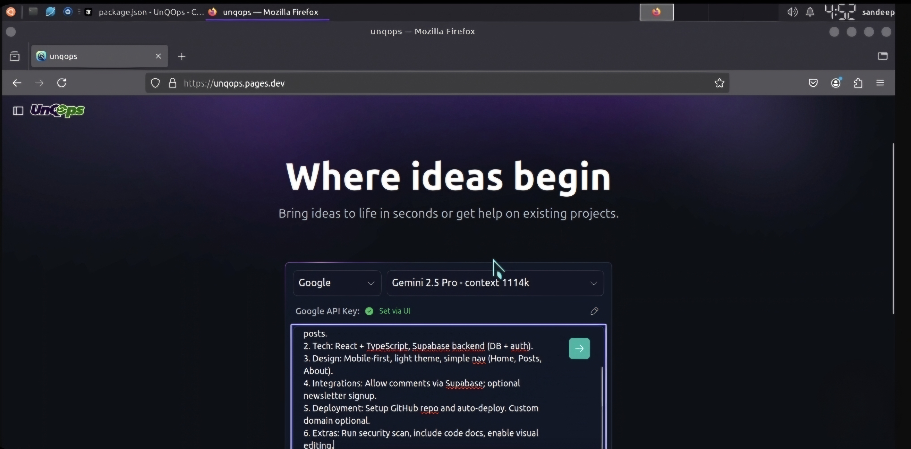

# UnQOps

[](https://unqops.dev)

**UnQOps** is a powerful, open-source AI-powered full-stack web development platform that runs entirely in your browser. Build complete web applications using natural language prompts with support for multiple AI models and providers.

## 🚀 Key Features

- **🤖 Multi-LLM Support**: Choose from OpenAI, Anthropic, Ollama, OpenRouter, Gemini, LMStudio, Mistral, xAI, HuggingFace, DeepSeek, Groq, and more
- **🌐 Browser-Based Development**: Complete development environment with no local setup required
- **📁 Project Management**: Create, edit, and manage full-stack applications
- **🔄 Real-time Preview**: Instant preview of your applications as you build
- **💾 Multiple Export Options**: Download as ZIP, deploy to Netlify, or sync to local folders
- **🖼️ Visual Context**: Attach images to prompts for better AI understanding
- **📱 Mobile Friendly**: Responsive design that works on all devices
- **🔧 Integrated Terminal**: Full terminal access with streaming command output
- **⚡ Hot Reload**: Real-time updates and live reloading

## 🎯 Perfect For

- **Rapid Prototyping**: Quickly build and test ideas
- **Learning & Education**: Perfect for students and developers learning new technologies
- **Client Demos**: Create impressive prototypes for client presentations
- **Hackathons**: Fast development cycles for competitive coding
- **Proof of Concepts**: Validate ideas before full development

## 🚀 Quick Start

### Option 1: Instant Deployment (Recommended)

Deploy UnQOps to Cloudflare Pages with one click:

[](https://deploy.workers.cloudflare.com/?url=https://github.com/Sandeepgaddam5432/UnQOps)

### Option 2: Local Development

#### Prerequisites
- Node.js 18+ ([Download here](https://nodejs.org/))
- pnpm package manager

#### Installation Steps

1. **Clone the repository**:
   ```bash
   git clone https://github.com/Sandeepgaddam5432/UnQOps.git
   cd UnQOps
   ```

2. **Install dependencies**:
   ```bash
   npm install -g pnpm
   pnpm install
   ```

3. **Start development server**:
   ```bash
   pnpm run dev
   ```

4. **Open your browser** and navigate to `http://localhost:5173`

### Option 3: Docker Deployment

For containerized deployment:

```bash
# Build the image
docker build . --target unqops-development

# Run with Docker Compose
docker compose --profile development up
```

## 🔑 Configuration

### Setting Up API Keys

1. Open UnQOps in your browser
2. Click the provider dropdown in the interface
3. Select your preferred AI provider
4. Click the edit (pencil) icon
5. Enter your API key securely

### Supported AI Providers

| Provider | Models Available | Custom Base URL |
|----------|------------------|-----------------|
| **OpenAI** | GPT-4, GPT-3.5, etc. | ✅ |
| **Anthropic** | Claude 3.5 Sonnet, Claude 3 Opus | ✅ |
| **Google** | Gemini Pro, Gemini Ultra | ❌ |
| **Ollama** | Llama 2, CodeLlama, Mistral | ✅ |
| **Groq** | Llama 2, Mixtral | ✅ |
| **DeepSeek** | DeepSeek Coder | ✅ |
| **xAI** | Grok Beta | ❌ |
| **HuggingFace** | Various OSS models | ✅ |
| **LM Studio** | Local models | ✅ |

### Custom Base URLs

For providers supporting custom endpoints:

1. Click the settings icon in the sidebar
2. Navigate to "Providers" tab
3. Search for your provider
4. Enter your custom base URL

## 📦 Deployment Options

### Cloudflare Pages (Recommended)

UnQOps is optimized for Cloudflare Pages deployment:

1. **One-Click Deploy**: Use the deploy button above
2. **Manual Deploy**: 
   - Fork this repository
   - Connect your GitHub account to Cloudflare Pages
   - Select the repository and deploy

### Netlify

Deploy directly to Netlify from the UnQOps interface:

1. Build your application in UnQOps
2. Click the "Deploy to Netlify" button
3. Follow the deployment wizard

### Local Export

- **ZIP Download**: Download your complete project as a ZIP file
- **Folder Sync**: Sync projects to a local directory for further development
- **GitHub Integration**: Push projects directly to GitHub repositories

## 🛠️ Development Scripts

```bash
# Development
pnpm run dev              # Start development server
pnpm run build            # Build for production
pnpm run preview          # Preview production build

# Testing & Quality
pnpm test                 # Run test suite
pnpm run typecheck        # TypeScript type checking
pnpm run lint:fix         # Fix linting issues

# Deployment
pnpm run build          # Deploy to Cloudflare Pages
pnpm run start            # Run production build locally
```

## 🏗️ Architecture

UnQOps is built with modern web technologies:

- **Frontend**: React + Vite + TypeScript
- **Styling**: Tailwind CSS
- **Runtime**: WebContainers API for browser-based execution
- **AI Integration**: Vercel AI SDK for multi-provider support
- **Deployment**: Cloudflare Pages + Workers

## 🤝 Contributing

We welcome contributions! Here's how to get started:

1. Fork the repository
2. Create a feature branch: `git checkout -b feature/amazing-feature`
3. Commit your changes: `git commit -m 'Add amazing feature'`
4. Push to the branch: `git push origin feature/amazing-feature`
5. Open a Pull Request

See our [Contributing Guide](CONTRIBUTING.md) for detailed guidelines.

## 🌟 Community

- **Discord**: [Join our community](https://discord.gg/unqops)
- **GitHub Discussions**: [Ask questions and share ideas](https://github.com/Sandeepgaddam5432/UnQOps/discussions)
- **Documentation**: [Full documentation](https://Sandeepgaddam5432.github.io/UnQOps/)

## 📋 Roadmap

### Current Focus
- Enhanced multi-file editing capabilities
- Improved AI model performance optimization
- Advanced project templates and scaffolding
- Better mobile experience

### Upcoming Features
- VS Code integration
- Advanced debugging tools
- Team collaboration features
- Plugin/extension system

## 🔒 Enterprise & Licensing

### Open Source License
UnQOps source code is distributed under the MIT License.

### WebContainers Commercial License
Production usage in commercial, for-profit settings requires a [WebContainers API license](https://webcontainers.io/enterprise). Contact us for enterprise licensing options.

---

<div align="center">

**Built with ❤️ by the Sandeep Gaddam**

[Website](https://unqops.pages.dev) 

</div>
